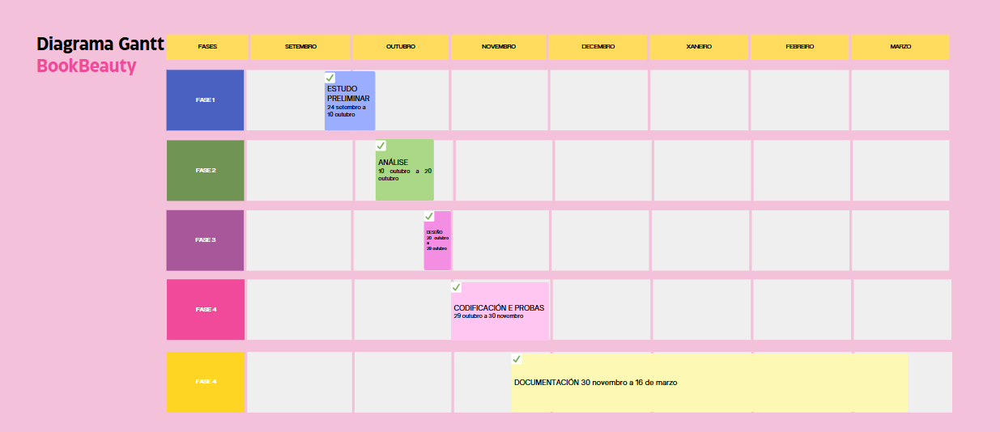

# FASE DE PLANIFICACIÓN DO PROXECTO "BookBeauty"

## Obxectivos do proxecto
O obxectivo principal da aplicación é permitir que tanto os administradores dos negocios coma os clientes poidan acceder e xestionar eficazmente as citas segundo os servizos ofertados e duración dos mesmos, así como consultar as datas dispoñibles.

### Calendario:

O proxecto lévase a cabo desde  o 24 de setembro, día da primeira reunión informativa sobre a FCT e os proxectos de fin de ciclo onde comezo co estudo preliminar, ata o 15 de decembro ,data límite para a entrega do proxecto.

#### Fase 1: Estudo preliminar

- Data de inicio: 24 de setembro.
- Data de término: 10 de outubro.
- Duración estimada: 2 semanas

Durante esta fase, depois de idear como estará enfocado o meu proxecto, realizarase unha análise das necesidades do mesmo, competencia existente así como funcionalidades a mellorar para destacar o proxecto sobre a competencia.

Durante o estudo tamén se exprorarán diferentes tipos de tecnoloxías, incluíndo linguaxes de programación e sistemas xestores de Bases de Datos. Finalmente decidín empregar como linguaxe PHP e unha base de datos relacional SQL, debido á facilidade, familiaridade de uso e compatibilidade co obxectivo do proxecto. 

Nesta fase tamén foi elaborado o anteproxecto, onde se presenta cómo será (a grandes rasgos e sin profundizar moito) o proxecto a levar a cabo.

#### Fase 2: Análise

- Data de inicio: 10 de outubro
- Data de término: 20 de outubro
- Duración estimada: 10 días

Durante esta etapa, mirarei moi de cerca as necesidades do noso sistema, funcionalidades importantes a implementar e cómo organizarei a aplicación. Valorarei en detalle as necesidades do público en canto á funcionalidade da aplicación e como organizala para que funcione de xeito eficiente. 

#### Fase 3: Deseño

- Data de inicio: 20 de outubro
- Data de término: 29 de outubro 
- Duración estimada: 1o días

Durante esta  fase elaboraranse os deseños da interface de usuario (HTML, CSS e Bootstap), o esquema e organización da base de datos e a arquitectura xeral da aplicación.

#### Fase 4: Codificación e probas

- Data de inicio:  29 de outubro
- Data de término: 30 de novembro
- Duración estimada: 1 mes

Nesta etapa, empezarase a escribir o código da aplicación segundo as ideas e esquemas establecidos anteriormente. De atoparse con algunha dificultade, seguirase aprendendo e formando nas linguaxes de programación e tecnoloxías elexidas. Ao mesmo tempo que se desenvolve o código, faránse probas para asegurarse de que o software funcione ben e sexa de calidade.

#### Fase 5: Documentación

- Data de inicio:  30 de novembro
- Data de término: 15 de decembro
- Duración estimada: 15 días

Nesta etapa final, completaránse aqueles aspectos da documentació nque quedaban sen responder, elaboraránse os esquemas e diagramas e detallarase a planificación de todo o proxecto.

#### Data de presentación do proxecto:

- Data de entrega do proxecto: 15 de decembro. Esta data representa o término do proxecto e a entrega de todos os documentos, manuais e da aplicación finalizada.
- Data de término xeral: 18/19 de decembro, días nos que se levará a cabo a presentación do proxecto ante tribunal.

### Diagrama de Gantt

## Plan de orzamento para "BookBeauty"
O orzamento do proxecto será a suma do importe dos materiais precisados para realizar o proxecto máis o importe que corresponde ao traballo realizado. Teránse en conta os seguintes custos/inversións:

- Materiais que se utilizan: no caso de BookBeauty, farase unha inversión inicial de 1.500€ dedicados a equipos(ordenador preparado para o desenvolvemento de aplicacións web).
- Custo horario das persoas que participan directamente na actividade: Segundo talent.com, un programador en España, de media, gaña anualmente uns 28.500€, o que se traducen en 14,62€ á hora. Calcularánse os gastos de persoal tendo en conta que o proxecto levouse a cabo en 59 días (habendo descontado as fins de semana) aproximadamente.
- Gastos de xestión e alta como autónoma.

### Orzamento por actividade

| **ACTIVIDADE**                      | **DURACIÓN**    | **CUSTO PERSOAS** (€) | **CUSTO RECURSOS MATERIAIS** (€) | **CUSTO TOTAL ACTIVIDADE** (€) |
|-------------------------------------|-----------------|-----------------------|---------------------------------|--------------------------------|
| Estudo preliminar                   | 2 semanas       | 416,40                | 0                               | 416,40                         |
| Análise                             | 10 días         | 732,00                | 0                               | 732,00                         |
| Deseño                              | 10 días         | 732,00                | 100,00                          | 832,00                         |
| Codificación e probas               | 1 mes           | 2.332,00              | 0                               | 2.332,00                       |
| Documentación                       | 15 días         | 1.116,00              | 50,00                           | 1.166,00                       |
| **TOTAL PROXECTO**                   | **59 días**     | **5.328,40**          | **150,00**                      | **5.478,40**                   |

### Orzamento por partidas de inversión / gasto:

| **CONCEPTO**                               | **IMPORTE (€)**    |
|--------------------------------------------|--------------------|
| **A) INVERSIÓNS**                          |                    |
| Gastos de establecemento e gastos de constitución | 300,00             |
| Total inmobilizacións inmateriais          | 0,00               |
| Terreos                                    | 0,00               |
| Construcións                               | 0,00               |
| Instalacións técnicas                      | 0,00               |
| Maquinaria                                  | 0,00               |
| Ferramentas                                 | 50,00              |
| Mobiliario e instalacións                  | 0,00               |
| Equipos informáticos                       | 1.500,00           |
| Elementos de transporte                    | 0,00               |
| Outro inmobilizado material                | 0,00               |
| Total inmobilizacións materiais            | 1.550,00           |
| Outros gastos a distribuír en varios exercicios | 0,00             |
| **TOTAL INVERSIÓNS**                       | **1.850,00**       |
| **B) GASTOS**                              |                    |
| Compras de materiais                       | 100,00             |
| Arrendamentos                              | 0,00               |
| Alta como autónomo                        | 60,00              |
| Mensualidade de xestor                    | 80,00              |
| Persoal                                    | 5.328,40           |
| Reparacións e conservación                 | 0,00               |
| Servizos de profesionais independentes     | 0,00               |
| Outros gastos xerais                       | 50,00              |
| Gastos financeiros                         | 0,00               |
| Amortizacións                              | 0,00               |
| Gastos de xestión e administración         | 0,00               |
| **TOTAL GASTOS**                           | **5.618,40**       |
| **TOTAL ORZAMENTO**                       | **7.468,40**       |