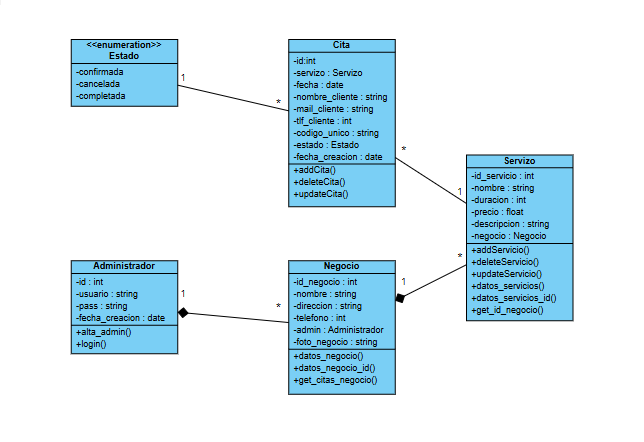
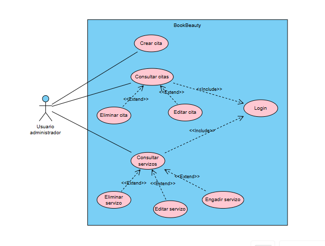
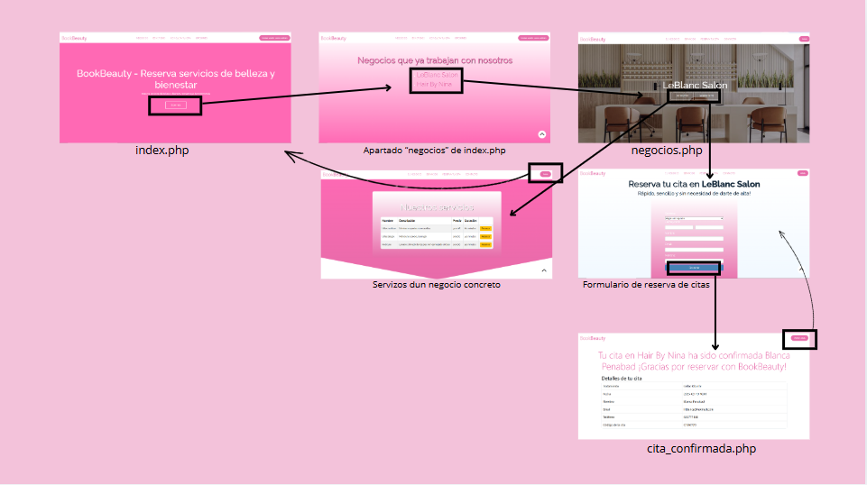

# FASE DE DESEÑO

## Modelo conceptual do dominio da aplicación e/ou Diagrama de clases [usando UML, ConML, ou linguaxe semellante].

## Casos de uso
Nos casos de uso temos ao usuario cliente, o cal non require de identificación, e o usuario administrador que si ten que identificarse.

O usuario cliente só vai poder consultar, editar e eliminar as súas citas así como axendar outras novas, mentres que o administrador vai ser capaz de crear, editar e eliminar citas e servizos ofertados.

### a) Casos de usuario cliente anónimo:

### b) Casos de usuario administrador:

## Deseño de interface de usuarios: Diagramas de navegación e mockups.

### a) Usuario cliente anónimo:

### b) Usuario administrador:

## Diagrama de Base de Datos.

## Diagrama de compoñentes software que constitúen o produto e de despregue.
